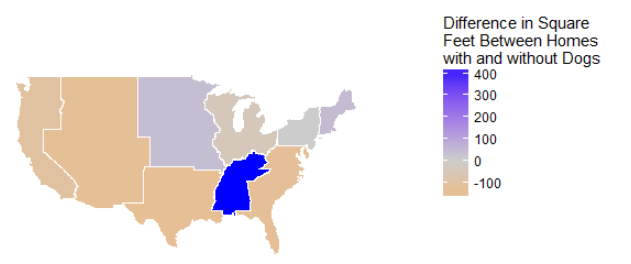
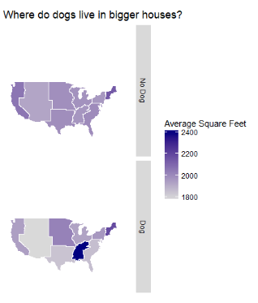

# explore_housing_data
Use data and visualizations to tell an evidence-based story about US housing

#Dog Owners’ Houses Are no Bigger, Except in South Appalachia

According to Zillow’s survey, people that live with dogs don’t choose substantially larger or smaller houses than people without such furry companions. The exception to this finding is dwellers in the East South Central region that spans from Kentucky through Mississippi. The metric used was the average home square footage of both homeowners and renters. 

To reach this finding, I calculated weighted means using the square footage that survey participants reported for their homes. I did this calculation separately for both dog owners and people without dogs. Each participants’ reported square footage was weighted by how representative they were of a “typical” American. Upon finding that the average difference in square footage for national aggregates was around 1%, I decided to disaggregate the data by nine census regions.

Most census regions showed a similar pattern. The grand exception was the region that spans from Kentucky to Mississippi -- where dog owners had homes that were, on average, 23% larger.

For real estate industry professionals, these findings mean that dog ownership is unlikely to influence a consumer’s home size preferences, with one geographic exception. This could help such professionals customize real estate advertising based on pet ownership in the East South Central region and allocate resources for such advertising to different demographic characteristics elsewhere.

